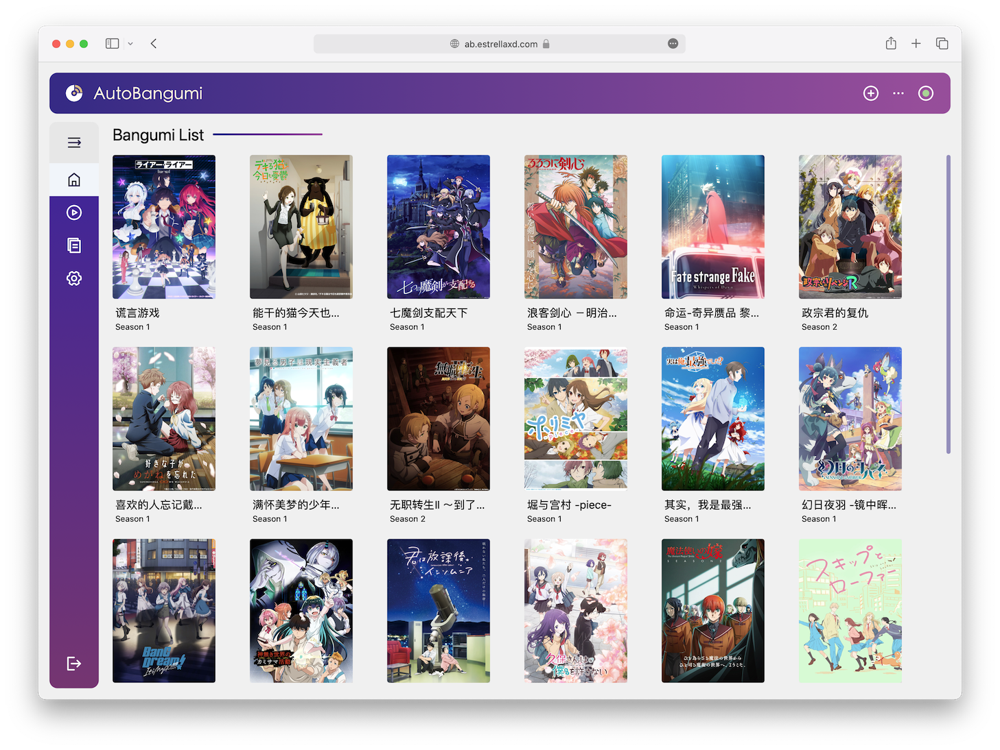

<p align="center">
    
    
</p>
<p align="center">
    
    
    
    
</p>

<p align="center">
  <a href="https://www.autobangumi.org">官方网站</a> | <a href="https://www.autobangumi.org/deploy/quick-start.html">快速开始</a> | <a href="https://www.autobangumi.org/changelog/3.0.html">更新日志</a> | <a herf="https://t.me/autobangumi_update">更新推送</a> | <a href="https://t.me/autobangumi">TG 群组</a>
</p>

# 项目说明

<p align="center">
    
</p>

本项目是基于 RSS 的全自动追番整理下载工具。只需要在 [Mikan Project][mikan] 等网站上订阅番剧，就可以全自动追番。
并且整理完成的名称和目录可以直接被 [Plex][plex]、[Jellyfin][plex] 等媒体库软件识别，无需二次刮削。

## AutoBangumi 功能说明

- 简易单次配置就能持续使用
- 无需介入的 `RSS` 解析器，解析番组信息并且自动生成下载规则。
- 番剧文件整理:

    ```
    Bangumi
    ├── bangumi_A_title
    │   ├── Season 1
    │   │   ├── A S01E01.mp4
    │   │   ├── A S01E02.mp4
    │   │   ├── A S01E03.mp4
    │   │   └── A S01E04.mp4
    │   └── Season 2
    │       ├── A S02E01.mp4
    │       ├── A S02E02.mp4
    │       ├── A S02E03.mp4
    │       └── A S02E04.mp4
    ├── bangumi_B_title
    │   └─── Season 1
    ```

- 全自动重命名，重命名后 99% 以上的番剧可以直接被媒体库软件直接刮削

    ```
  [Lilith-Raws] Kakkou no Iinazuke - 07 [Baha][WEB-DL][1080p][AVC AAC][CHT][MP4].mp4 
  >>
   Kakkou no Iinazuke S01E07.mp4
  ```

- 自定义重命名，可以根据上级文件夹对所有子文件重命名。
- 季中追番可以补全当季遗漏的所有剧集
- 高度可自定义的功能选项，可以针对不同媒体库软件微调
- 支持多种 RSS 站点，支持聚合 RSS 的解析。
- 无需维护完全无感使用
- 内置 TDMB 解析器，可以直接生成完整的 TMDB 格式的文件以及番剧信息。

## [Roadmap](https://github.com/users/EstrellaXD/projects/2)


***计划开发的功能：***

- Transmission 的支持。

## Star History

[](https://star-history.com/#EstrellaXD/Auto_Bangumi)

## 贡献

欢迎提供 ISSUE 或者 PR, 贡献代码前建议阅读 [CONTRIBUTING.md](CONTRIBUTING.md)。

贡献者名单请见：

<a href="https://github.com/EstrellaXD/Auto_Bangumi/graphs/contributors"></a>


## Licence

[MIT licence](https://github.com/EstrellaXD/Auto_Bangumi/blob/main/LICENSE)

[mikan]: https://mikanani.me
[plex]: https://plex.tv
[jellyfin]: https://jellyfin.org
