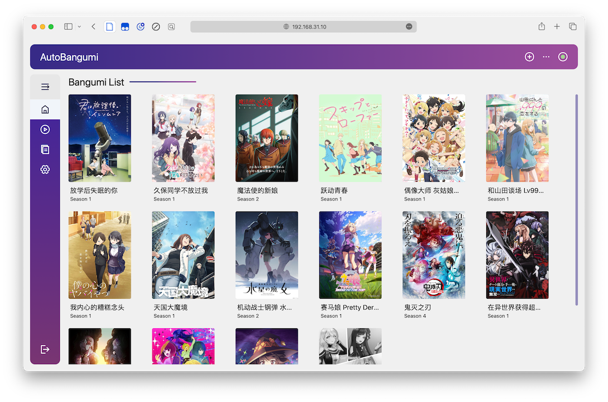

<p align="center">
    
    
</p>
<p align="center">
    
    
    
    
</p>

# 项目说明

<p align="center">
    
</p>

本项目是基于 [Mikan Project](https://mikanani.me)、[qBittorrent](https://qbittorrent.org) 的全自动追番整理下载工具。只需要在 [Mikan Project](https://mikanani.me) 上订阅番剧，就可以全自动追番。并且整理完成的名称和目录可以直接被 [Plex]()、[Jellyfin]() 等媒体库软件识别，无需二次刮削。

[主项目地址](https://www.github.com/EstrellaXD/Auto_Bangumi)
/ [WebUI 仓库](https://github.com/Rewrite0/Auto_Bangumi_WebUI)
/ [Wiki 说明](https://www.github.com/EstrellaXD/Auto_Bangumi/wiki)

## AutoBangumi 功能说明

- 简易单次配置就能持续使用
- 无需介入的 `RSS` 解析器，解析番组信息并且自动生成下载规则。
- 番剧文件整理:

    ```
    Bangumi
    ├── bangumi_A_title
    │   ├── Season 1
    │   │   ├── A S01E01.mp4
    │   │   ├── A S01E02.mp4
    │   │   ├── A S01E03.mp4
    │   │   └── A S01E04.mp4
    │   └── Season 2
    │       ├── A S02E01.mp4
    │       ├── A S02E02.mp4
    │       ├── A S02E03.mp4
    │       └── A S02E04.mp4
    ├── bangumi_B_title
    │   └─── Season 1
    ```

- 全自动重命名，重命名后 99% 以上的番剧可以直接被媒体库软件直接刮削

    ```
  [Lilith-Raws] Kakkou no Iinazuke - 07 [Baha][WEB-DL][1080p][AVC AAC][CHT][MP4].mp4 
  >>
   Kakkou no Iinazuke S01E07.mp4
  ```

- 自定义重命名，可以根据上级文件夹对所有子文件重命名。
- 季中追番可以补全当季遗漏的所有剧集
- 高度可自定义的功能选项，可以针对不同媒体库软件微调
- 无需维护完全无感使用
- 内置 TDMB 解析器，可以直接生成完整的 TMDB 格式的文件以及番剧信息。
- 对于 Mikan RSS 的反代支持。

## 如何开始

- **[部署说明 (Official)](https://github.com/EstrellaXD/Auto_Bangumi/wiki)**
- **[2.6版本更新说明](https://github.com/EstrellaXD/Auto_Bangumi/wiki/2.6更新说明)**
- **[部署说明 (手把手)](https://www.himiku.com/archives/auto-bangumi.html)**

## 相关群组

- 更新推送：[Telegram Channel](https://t.me/autobangumi_update)
- Bug 反馈群：[Telegram](https://t.me/+yNisOnDGaX5jMTM9)

## Roadmap

***开发中的功能：***

- Web UI #57 ✅
- 文件统一整理，对单个规则或者文件微调文件夹可以自动调整所有对应的文件。
- 通知功能，可以通过 IFTTT 等方式通知用户番剧更新进度。✅
- 剧场版以及合集的支持。✅
- 各类 API 接口。

***计划开发的功能：***

- 对其他站点种子的解析归类。
- 本地化番剧订阅方式。
- Transmission & Aria2 的支持。
- 更完善的 WebUI。

# 声明

## 致谢

感谢 [Sean](https://github.com/findix) 提供的大量帮助
感谢 [Rewrite0](https://github.com/Rewrite0) 开发的 WebUI

## Star History

[](https://star-history.com/#EstrellaXD/Auto_Bangumi)

## Licence

[MIT licence](https://github.com/EstrellaXD/Auto_Bangumi/blob/main/LICENSE)
