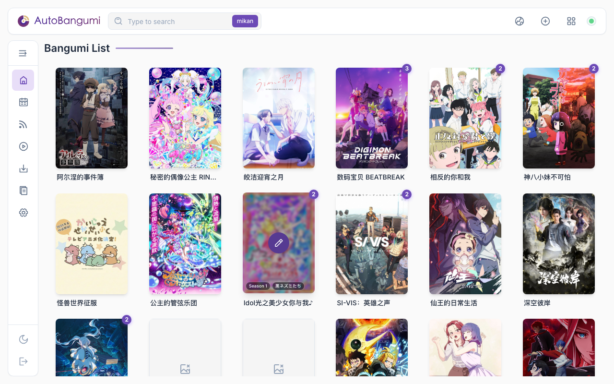

<p align="center">
    
    
</p>
<p align="center">
    
    
    
    
</p>

<p align="center">
  简体中文 | <a href="README.en.md">English</a> | <a href="README.ja.md">日本語</a>
</p>

<p align="center">
  <a href="https://www.autobangumi.org">官方网站</a> | <a href="https://www.autobangumi.org/deploy/quick-start.html">快速开始</a> | <a href="https://www.autobangumi.org/deploy/upgrade-4.0">升级到 4.0</a> | <a href="https://www.autobangumi.org/changelog/4.0.html">更新日志</a> | <a href="https://t.me/autobangumi_update">更新推送</a> | <a href="https://t.me/autobangumi">TG 群组</a>
</p>

# 项目说明

<p align="center">
    
</p>

AutoBangumi 是基于 RSS 的全自动追番整理下载工具。在 [Mikan Project][mikan] 等网站订阅番剧后，AutoBangumi 解析种子标题、生成下载规则、把种子交给下载器，并把完成的文件整理成 [Plex][plex]、[Jellyfin][jellyfin] 等媒体库软件可以直接识别的目录与文件名，无需二次刮削。

## 核心功能

- 无需介入的 RSS 解析器：解析番组信息，自动生成下载规则；支持 Mikan、DMHY、Nyaa 等站点和聚合 RSS
- 内置 Mikan 与 TMDB 元数据解析；可选 LLM 标题解析（OpenAI 兼容接口、Anthropic Claude、Google Gemini）
- 季中追番可以补全当季遗漏的剧集；识别剧场版、OVA、OAD、SP 并单独整理
- 单番发布偏好：为单个番剧设置字幕组与分辨率偏好，避免同集重复下载
- 首次运行设置向导；程序内检查、应用和回滚更新（sha256 与 ed25519 签名校验）
- 下载器：qBittorrent、aria2
- 文件整理与重命名：

    ```
    Bangumi
    ├── bangumi_A_title
    │   ├── Season 1
    │   │   ├── A S01E01.mp4
    │   │   └── A S01E02.mp4
    │   └── Season 2
    │       └── A S02E01.mp4
    └── bangumi_B_title
        └── Season 1
    ```

    ```
    [Lilith-Raws] Kakkou no Iinazuke - 07 [Baha][WEB-DL][1080p][AVC AAC][CHT][MP4].mp4
    >>
    Kakkou no Iinazuke S01E07.mp4
    ```

## 4.0 新特性

- **插件运行时**：搜索站点、通知渠道、重命名方式、下载器等扩展点都基于 `ab_sdk` 契约。内置插件 `ingest-filters`（全局包含过滤）、`rename`、`hardlink`、`media-server-refresh`（整理后刷新 Jellyfin / Emby / Plex）。
- **多下载器实例**：下载器在 `plugins.instances` 中配置，`plugins.slots.downloader` 指定默认实例。新种子按 规则 → 订阅 → 默认实例 的顺序选择下载器。
- **硬链接插件 `hardlink`**：默认停用。整理完成后把正片与字幕链接到媒体库目录，下载目录继续做种。`path_map` 按下载器实例转换路径；跨文件系统时默认复制（`cross_device`: `copy` / `symlink` / `skip`）。
- **重命名插件 `rename`**：提供 `pn`、`advance` 和 Jinja2 模板 `template`。模板渲染失败时跳过该文件并发送通知，不退回其它方式。
- **事件与 MCP**：`/api/v1/events/stream`（SSE）推送宿主与插件事件；`/mcp` 提供 MCP 服务，插件可以注册自己的 MCP 工具与 REST 路由。
- **前端插件挂载点**：插件可以在设置页、番剧详情页等位置挂载自己的组件。
- **插件 SDK**：`autobangumi-sdk` 轮子（含 `ab-plugin` 命令行）与 `autobangumi-plugin` agent skill 随 GitHub Release 发布，不发布到 PyPI。

## 快速开始

```bash
mkdir -p ${HOME}/AutoBangumi/{config,data}
cd ${HOME}/AutoBangumi
```

创建 `docker-compose.yml`：

```yaml
services:
  AutoBangumi:
    image: "ghcr.io/estrellaxd/auto_bangumi:latest"
    container_name: AutoBangumi
    volumes:
      - ./config:/app/config
      - ./data:/app/data
    ports:
      - "7892:7892"
    # 程序内更新依赖此重启策略
    restart: unless-stopped
    environment:
      - TZ=Asia/Shanghai
      - PGID=${PGID:-1000}
      - PUID=${PUID:-1000}
      - UMASK=022
```

```bash
docker compose up -d
```

打开 `http://<主机地址>:7892`，按设置向导完成配置。4.0 测试版请使用 `4.0.0-beta.N` 或 `dev-latest` 标签。更多部署方式见 [部署文档](https://www.autobangumi.org/deploy/quick-start.html)。

## 从 3.x 升级

- 4.0 只支持从 **3.3.x** 升级，更早的版本请先升级到 3.3。
- 首次启动时，配置迁移器把 `downloader`、重命名方式与版本冲突策略移到 `plugins` 配置段，原文件备份为 `config/config.json.v3.bak`。迁移失败时程序恢复原文件并拒绝启动。
- 详细步骤与回退方法见 [升级到 4.0](https://www.autobangumi.org/deploy/upgrade-4.0)。

## 插件开发

```bash
uv tool install ./autobangumi_sdk-<版本>-py3-none-any.whl   # 从 GitHub Release 下载
ab-plugin new my-plugin --kind rename
ab-plugin validate my-plugin
ab-plugin pack my-plugin
```

- 开发文档：[插件开发](https://www.autobangumi.org/dev/plugins.html)
- 示例插件：[`examples/plugins/`](examples/plugins)

## 贡献

欢迎提供 ISSUE 或者 PR，贡献代码前建议阅读 [CONTRIBUTING.md](CONTRIBUTING.md)。[Roadmap](https://github.com/users/EstrellaXD/projects/2)

<a href="https://github.com/EstrellaXD/Auto_Bangumi/graphs/contributors"></a>

## Star History

[](https://star-history.com/#EstrellaXD/Auto_Bangumi)

## Licence

[MIT licence](https://github.com/EstrellaXD/Auto_Bangumi/blob/main/LICENSE)

[mikan]: https://mikanani.me
[plex]: https://plex.tv
[jellyfin]: https://jellyfin.org
