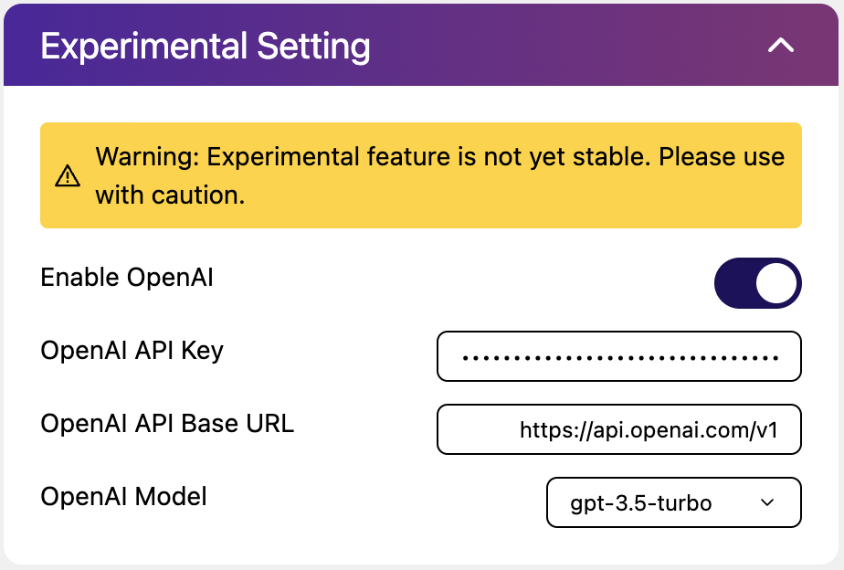

# 实验功能配置

::: warning 警告
实验功能尚未处于测试阶段，开启后可能会导致预料之外的问题并且在未来某些版本中很可能被移除，请谨慎使用！
:::
## OpenAI ChatGPT

{width=500}{class=ab-shadow-card}

使用 OpenAI ChatGPT 以获得更好的标题结构化解析效果，例如：

```
input: "【喵萌奶茶屋】★04月新番★[夏日重现/Summer Time Rendering][11][1080p][繁日双语][招募翻译]"
output: '{"group": "喵萌奶茶屋", "title_en": "Summer Time Rendering", "resolution": "1080p", "episode": 11, "season": 1, "title_zh": "夏日重现", "sub": "", "title_jp": "", "season_raw": "", "source": ""}'
```

- **Enable OpenAI** 为是否开启 OpenAI 并使用 ChatGPT 用于标题解析。
- **OpenAI API Key** 为 OpenAI 账户的 API Key。
- **OpenAI API Base URL** 为 OpenAI 接口地址，默认情况下为 OpenAI 官方地址；你也可以根据自己的需要修改成其他兼容 OpenAI 服务的第三方地址。
- **OpenAI Model** 为 ChatGPT 的 `model` 模型参数，目前仅提供了 `gpt-3.5-turbo`，因为它足够便宜并且在 Prompt 的加持下可以得到相当不错的效果。

### `config.json` 中的配置选项

在配置文件中对应选项如下：

配置文件部分：`experimental_openai`

| 参数名     | 参数说明       | 参数类型 | WebUI 对应选项 | 默认值      |
|---------|------------|------|------------|----------|
| enable  | 是否启用 OpenAI 解析器    | 布尔值  | 启用 OpenAI         | false    |
| api_key    | OpenAI API Key       | 字符串  | OpenAI API Key       | |
| api_base   | OpenAI API Base URL   | 字符串  | OpenAI API Base URL   | https://api.openai.com/v1 |
| model | OpenAI 模型 | 字符串  | OpenAI 模型 | gpt-3.5-turbo