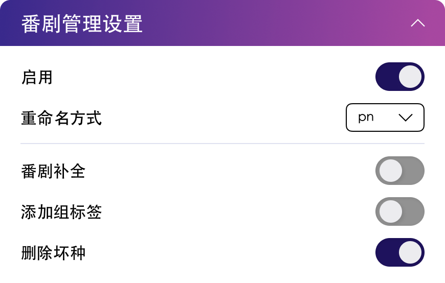

# Bangumi Manager Settings

## WebUI Configuration

{width=500}{class=ab-shadow-card}

 

- **Enable** enables the bangumi manager. If disabled, the settings below will not take effect.
- **Rename method** is the renaming method. Currently supported:
  - `pn` — `Torrent Title S0XE0X.mp4` format
  - `advance` — `Official Title S0XE0X.mp4` format
  - `none` — No renaming
- **Eps complete** enables episode completion for the current season. If enabled, missing episodes will be downloaded.
- **Add group tag** adds subtitle group tags to download rules.
- **Delete bad torrent** deletes errored torrents.
- [About file paths][1]
- [About renaming][2]

## `config.json` Configuration Options

The corresponding options in the configuration file are:

Configuration section: `bangumi_manager`

| Parameter          | Description                    | Type    | WebUI Option      | Default |
|--------------------|------------------------------ |---------|-------------------|---------|
| enable             | Enable bangumi manager        | Boolean | Enable manager    | true    |
| eps_complete       | Enable episode completion     | Boolean | Episode completion | false  |
| rename_method      | Rename method                 | String  | Rename method     | pn      |
| group_tag          | Add subtitle group tag        | Boolean | Group tag         | false   |
| remove_bad_torrent | Delete bad torrents           | Boolean | Remove bad torrent | false  |

[1]: https://www.autobangumi.org/faq/#download-path
[2]: https://www.autobangumi.org/faq/#file-renaming
