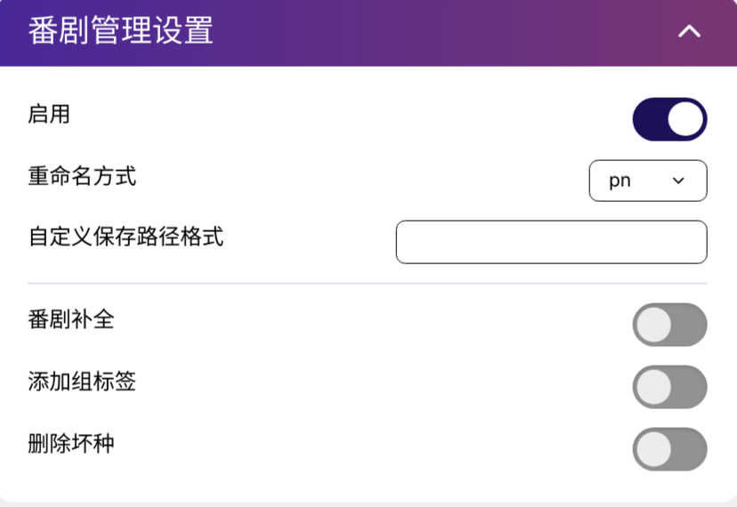

# 番剧管理器设置

## WebUI 配置

{width=500}{class=ab-shadow-card}

 

- **启用** 启用番剧管理器。如果禁用，下方设置将不会生效。
- **重命名方式** 为重命名方法。目前支持：
  - `pn` — `种子标题 S0XE0X.mp4` 格式
  - `advance` — `官方标题 S0XE0X.mp4` 格式
  - `none` — 不重命名
- **剧集补全** 启用当季剧集补全。如果启用，将下载缺失的剧集。
- **添加字幕组标签** 为下载规则添加字幕组标签。
- **删除错误种子** 删除出错的种子。
- [关于文件路径][1]
- [关于重命名][2]

## `config.json` 配置选项

配置文件中的对应选项如下：

配置节：`bangumi_manager`

| 参数               | 说明             | 类型    | WebUI 选项      | 默认值 |
|--------------------|------------------|---------|-----------------|--------|
| enable             | 启用番剧管理器   | 布尔值  | 启用管理器      | true   |
| eps_complete       | 启用剧集补全     | 布尔值  | 剧集补全        | false  |
| rename_method      | 重命名方式       | 字符串  | 重命名方式      | pn     |
| group_tag          | 添加字幕组标签   | 布尔值  | 字幕组标签      | false  |
| remove_bad_torrent | 删除错误种子     | 布尔值  | 删除错误种子    | false  |

[1]: https://www.autobangumi.org/faq/#download-path
[2]: https://www.autobangumi.org/faq/#file-renaming
