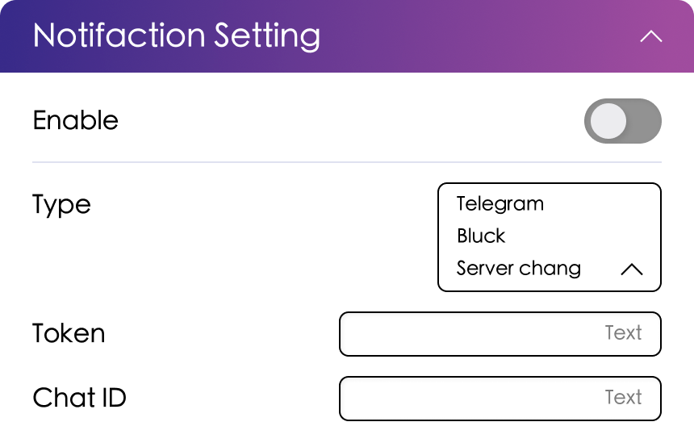

# 通知设置

## WebUI 配置

{width=500}{class=ab-shadow-card}

 

- **启用** 启用通知功能。如果禁用，下方设置将不会生效。
- **类型** 为通知类型。目前支持：
  - Telegram
  - Wecom
  - Bark
  - ServerChan
- **Chat ID** 仅在使用 `telegram` 通知时需要填写。[如何获取 Telegram Bot Chat ID][1]
- **Wecom**：在 Chat ID 字段填写自定义推送 URL，并在服务端添加[富文本消息][2]类型。[Wecom 配置指南][3]

## `config.json` 配置选项

配置文件中的对应选项如下：

配置节：`notification`

| 参数    | 说明          | 类型    | WebUI 选项      | 默认值   |
|---------|---------------|---------|-----------------|----------|
| enable  | 启用通知      | 布尔值  | 通知            | false    |
| type    | 通知类型      | 字符串  | 通知类型        | telegram |
| token   | 通知 Token    | 字符串  | 通知 Token      |          |
| chat_id | 通知 Chat ID  | 字符串  | 通知 Chat ID    |          |

[1]: https://core.telegram.org/bots#6-botfather
[2]: https://github.com/umbors/wecomchan-alifun
[3]: https://github.com/easychen/wecomchan
