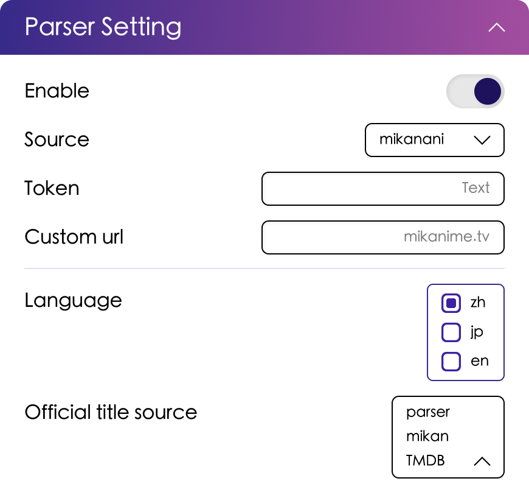

# 解析器设置

AB 的解析器用于解析聚合 RSS 链接，如果 RSS 有新条目更新，AB 就会解析标题并且生成自动下载规则。

## Webui 中的解析器设置

- **Enable**: 是否启用 RSS 解析器。
- **Source** 为 RSS 解析器类型，目前支持 `mikan` 。
- **Token** 为蜜柑计划的 Token。[蜜柑计划 Token 获取][rss_token]
- **Custom_url** 为自定义蜜柑计划地址。[自定义反代地址][reproxy]
- **Language** 为 RSS 解析器语言，目前支持 `zh` 、 `jp` 、 `en` 三种语言。
- **Parser_type** 为 **官方标题** 解析器解析类型，支持类型如下：
  - parser 为正则表达式解析器，使用正则表达式解析标题。
  - mikan 为蜜柑计划解析器，使用蜜柑计划解析标题。
  - tmdb 为 TMDB 解析器，使用 TMDB 解析标题。
- **Exclude** 为全局 RSS 解析器过滤器，可以填入字符串或者正则表达式，AB 在解析 RSS 时会过滤掉符合过滤器的条目。

## `config.json` 中的配置选项

在配置文件中对应选项如下：

配置文件部分：`rss_parser`

| 参数名         | 参数说明           | 参数类型 | WebUI 对应选项     | 默认值           |
|-------------|----------------|------|----------------|---------------|
| enable      | RSS 解析器是否启用    | 布尔值  | RSS 解析器是否启用    | true          |
| type        | RSS 解析器类型      | 字符串  | RSS 解析器类型      | mikan         |
| token       | RSS 解析器 Token  | 字符串  | RSS 解析器 Token  | token         |
| custom_url  | RSS 解析器自定义 URL | 字符串  | RSS 解析器自定义 URL | mikanime.tv   |
| parser_type | RSS 解析器解析类型    | 字符串  | RSS 解析器解析类型    | parser        |
| filter      | RSS 解析器过滤器     | 数组   | 过滤器            | [720,\d+-\d+] |
| language    | RSS 解析器语言      | 字符串  | RSS 解析器语言      | zh            |

[rss_token]: rss
[reproxy]: proxy##反向代理设置