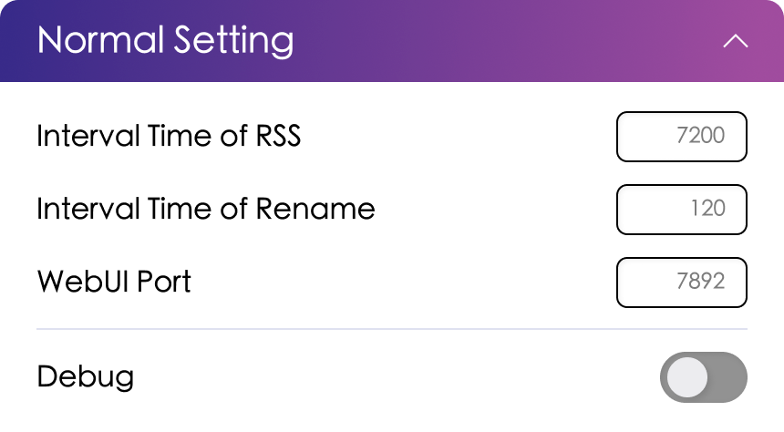

# Program Settings

## WebUI Configuration

{width=500}{class=ab-shadow-card}

 

- Interval Time parameters are in seconds. Convert to seconds if you need to set minutes.
- RSS is the RSS check interval, which affects how often automatic download rules are generated.
- Rename is the rename check interval. Modify this if you need to change how often renaming is checked.
- WebUI Port is the port number. Note that if you're using Docker, you need to remap the port in Docker after changing it.

## `config.json` Configuration Options

The corresponding options in the configuration file are:

Configuration section: `program`

| Parameter   | Description          | Type            | WebUI Option         | Default |
|-------------|---------------------|-----------------|---------------------|---------|
| rss_time    | RSS check interval  | Integer (seconds) | RSS check interval  | 7200    |
| rename_time | Rename check interval | Integer (seconds) | Rename check interval | 60    |
| webui_port  | WebUI port          | Integer         | WebUI port          | 7892    |
