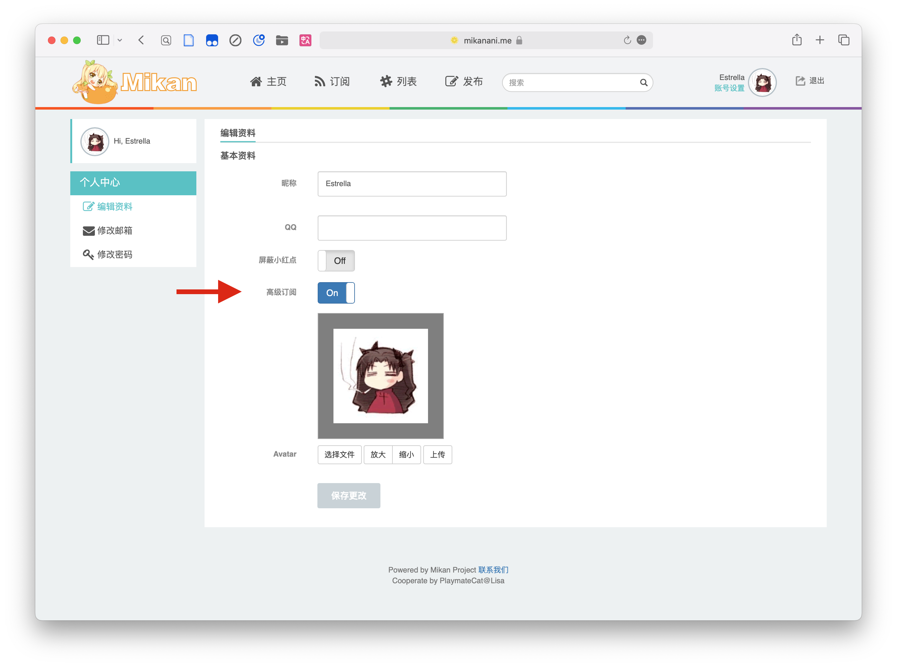

# 准备 Mikan RSS 订阅链接

AutoBangumi 可以自动解析 [Mikan Project][mikan-site] 的 RSS 订阅地址，根据字幕组以及番剧名称生成下载规则， 从而实现自动追番。
因此在开始自动追番之前，你需要准备好 [Mikan Project][mikan-site] 的 RSS 订阅地址。

需要注意的是，目前 Mikan Project 主站已经被墙，当你不知道如何使用代理时请使用如下链接进行访问订阅：

[Mikan Project CN][mikan-cn-site]

## 获取订阅地址

本项目基于解析 Mikan Project 提供的 RSS 地址，因此如果要实现自动追番，需要注册并且获得 Mikan Project 的 RSS 地址：

{data-zoomable}

获取的 RSS 地址如下：

```txt
https://mikanani.me/RSS/MyBangumi?token=xxxxxxxxxxxxxxxxxxxxxxxxxxxxxxxx
# 或者
https://mikanime.tv/RSS/MyBangumi?token=xxxxxxxxxxxxxxxxxxxxxxxxxxxxxxxx
```

AB 中需要填入的 `token` 为以上 url 中 `token=` 后面的一串字符。

## Mikan Project 订阅贴士

由于 AutoBangumi 会解析所有获得的 RSS 信息，因此在订阅番剧的时候需要注意以下几点：

{data-zoomable}

- 在个人设置中打开高级设置。
- 一部番剧只订阅一个字幕组，点击 Mikan Project 的番剧图片即可呼出二级菜单，选择一个字幕组订阅即可。
- 如果字幕组有简体繁体不同的字幕，Mikan Project 大多时候提供了选择订阅的方式，选择一种字幕订阅。
- 如果不提供简繁选择，那么可以在 AutoBangumi 中设置 `filter` 进行过滤，也可以在规则生成之后进入 qBittorrent 中手动过滤。
- 目前不支持 OVA 以及 剧场版 的订阅解析。
