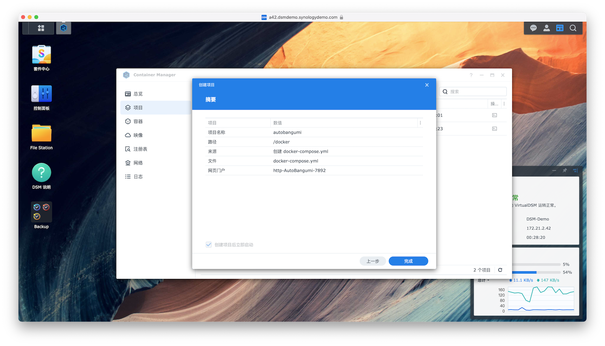

# 群晖 (DSM 7.2) 部署说明（ QNAP 同理）

在 DSM 7.2 中，已经支持了 Docker Compose，推荐使用 Docker Compose 一键部署本项目。

## 创建配置和数据存储文件夹

在 `/volume1/docker/` 下创建 `AutoBangumi` 文件夹，然后在 `AutoBangumi` 文件夹下创建 `config` 和 `data` 文件夹。

## 安装 Container Manager (Docker) 套件

进入套件中心，安装 Container Manager (Docker) 套件。

{data-zoomable}

## 通过 Docker compose 安装配置 AB

点击 **项目**，然后点击 **新建**，选择 **Docker Compose**。

{data-zoomable}

复制以下内容填入 **Docker Compose** 中。
```yaml
version: "3.4"

services:
  ab:
    image: "ghcr.io/estrellaxd/auto_bangumi:latest"
    container_name: "auto_bangumi"
    restart: unless-stopped
    ports:
      - "7892:7892"
    volumes:
      - "./config:/app/config"
      - "./data:/app/data"
    network_mode: bridge
    environment:
      - AB_METHOD=Advance
      - PGID=1000
      - PUID=1000
      - UMASK=022
```

点击 **下一步**，然后点击 **完成**。

{data-zoomable}

完成创建之后进入 `http://<NAS IP>:7892` 即可进入 AB 并进行配置。

## 通过 Docker compose 安装配置 AB 和 qBittorrent

在同时拥有代理和ipv6的情况下，群晖nas提供的docker配置ipv6极为复杂，推荐直接将AB和qBittorrent安装到host网络下，降低工作量。

以下内容的使用条件为：在docker上已经部署好了一个clash代理，并能够通过本地ip的指定端口进行访问。

参考上一节的内容，将以下内容经过调整填入 **Docker Compose** 中。

```yaml
  qbittorrent:
    container_name: qbittorrent
    image: linuxserver/qbittorrent
    hostname: qbittorrent
    environment:
      - PGID=1000  #需要自行修改填入
      - PUID=1000  #需要自行修改填入
      - WEBUI_PORT=8989
      - TZ=Asia/Shanghai
    volumes:
      - ./qb_config:/config
      - your_anime_path:/downloads # 注意 修改此处为自己存放动漫的目录,ab 内下载路径填写downloads
    networks:
      - host
    restart: unless-stopped

  auto_bangumi:
    container_name: AutoBangumi
    environment:
      - TZ=Asia/Shanghai
      - PGID=1000  #需要自行修改填入
      - PUID=1000  #需要自行修改填入
      - UMASK=022
      - AB_DOWNLOADER_HOST=127.0.0.1:8989  #建议自行修改端口号
    volumes:
      - /volume1/docker/ab/config:/app/config
      - /volume1/docker/ab/data:/app/data
    network_mode: host
    environment:
      - AB_METHOD=Advance
    dns:
      - 8.8.8.8
      - 223.5.5.5
    restart: unless-stopped
    image: "ghcr.io/estrellaxd/auto_bangumi:latest"
    depends_on:
      - qbittorrent

```

## 补充说明

其中的 PGID 与 PUID 需要自行寻找，群晖的新 NAS 通常应该是：`PUID=1026,PGID=100`，qBittorrent 对应的端口号在修改时注意保证所有位置全部修改完成。

如果需要设置代理，请参考: [设置代理](../config/proxy)

如果使用较低性能的机器，默认的配置有概率会大量占用 **CPU**，使得 AB 无法链接 qB 且 qB 的 WebUI 无法正常登陆的情况。

以 220+ 为例，qB 参考配置如下，减少下载与上传的连接数，降低 CPU 占用。

- 设置 -> 链接 -> 链接限制
  - 全局最大连接数: 300
  - 每torrent最大连接数: 60
  - 全局上传窗口数上限: 15
  - 每个torrent上传窗口数上限: 4
- BitTorrent
  - 最大活跃检查种子数 1
  - Torrent排队
    - 最大活动的下载数: 3
    - 最大活动的上传数: 5
    - 最大活动的torrent数: 10
- RSS
- RSS阅读器
  - 每个订阅源文章数目最大值: 50

