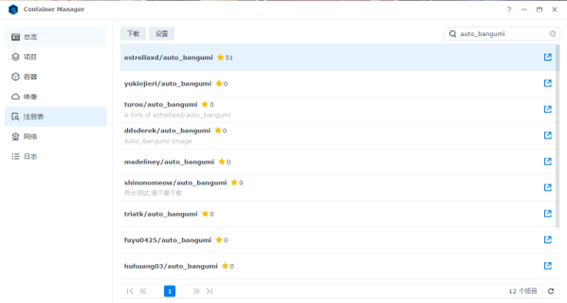
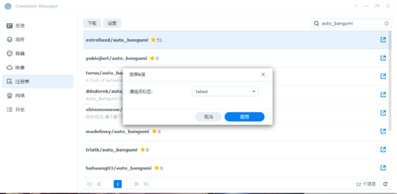
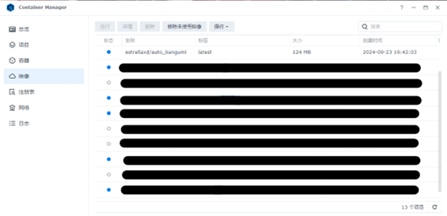
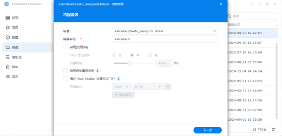
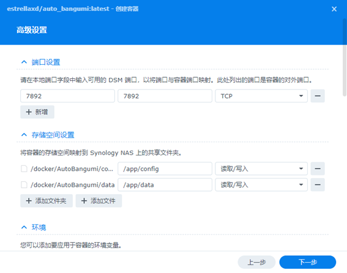
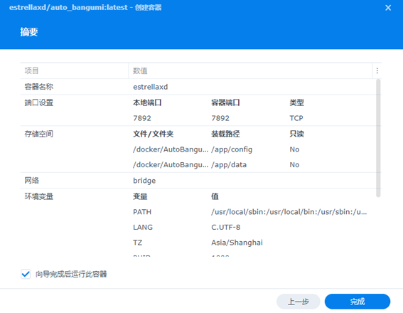

# 群晖通过 Container Manager 注册表部署AB教程

群晖在 DSM 7.2 中支持了 Docker Compose，但对于从群晖 Docker 开始接触的用户而言，使用传统的注册表安装方式更便于直观地进行安装及接受更新提醒。

虽然群晖 docker 的 IPv6 比较复杂，但实测在 Bridge 显示 IPv6 已停用的情况下依旧可以通过设置反向代理加强安全性的同时进行 IPv6 连接。

如有代理需求的请参考通过 Docker compose 安装配置 AB 的教程。

## 创建配置和数据存储文件夹

在 `/volume1/docker/` 下创建 `AutoBangumi` 文件夹，然后在 `AutoBangumi` 文件夹下创建 `config` 和 `data` 文件夹。

## 安装 Container Manager (Docker) 套件

进入套件中心，安装 Container Manager (Docker) 套件。

{data-zoomable}

## 通过注册表安装 AB

点击 **注册表**，然后在搜索栏输入 `auto_bangumi`，然后双击 **estrellaxd/auto_bangumi**。

{data-zoomable}

标签选择 **lastest** 然后点击**应用**，会自动下载镜像

{data-zoomable}

## 通过映像新建 AB 容器

切换到**映像**界面，单击下载好的镜像后点击上方的**运行**，开始进行配置

{data-zoomable}

自行输入**容器名称**后点击下一步

{data-zoomable}

在端口设置的**本地端口**输入对应**外部端口**

在**存储空间设置**分别选择之前配置好的 config 文件夹和 data 文件夹，在右侧栏中分别输入 `/app/config` 和 `/app/data`，效果如下图所示

{data-zoomable}

点击下一步，再点击完成，AB到此安装成功。

{data-zoomable}

之后进入 `http://<NAS IP>:你设置的端口号` 即可进入 AB 并进行配置。

## 补充说明

其中的 PGID 与 PUID 需要自行寻找，群晖的新 NAS 通常应该是：`PUID=1026,PGID=100`，qBittorrent 对应的端口号在修改时注意保证所有位置全部修改完成。

如果需要设置代理，请参考: [设置代理](../config/proxy)

如果使用较低性能的机器，默认的配置有概率会大量占用 **CPU**，使得 AB 无法链接 qB 且 qB 的 WebUI 无法正常登陆的情况。

以 220+ 为例，qB 参考配置如下，减少下载与上传的连接数，降低 CPU 占用。

- 设置 -> 链接 -> 链接限制
  - 全局最大连接数: 300
  - 每torrent最大连接数: 60
  - 全局上传窗口数上限: 15
  - 每个torrent上传窗口数上限: 4
- BitTorrent
  - 最大活跃检查种子数 1
  - Torrent排队
    - 最大活动的下载数: 3
    - 最大活动的上传数: 5
    - 最大活动的torrent数: 10
- RSS
- RSS阅读器
  - 每个订阅源文章数目最大值: 50

