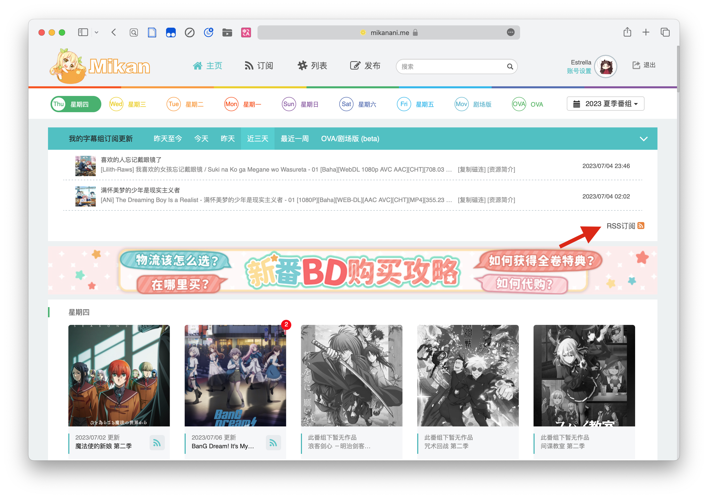
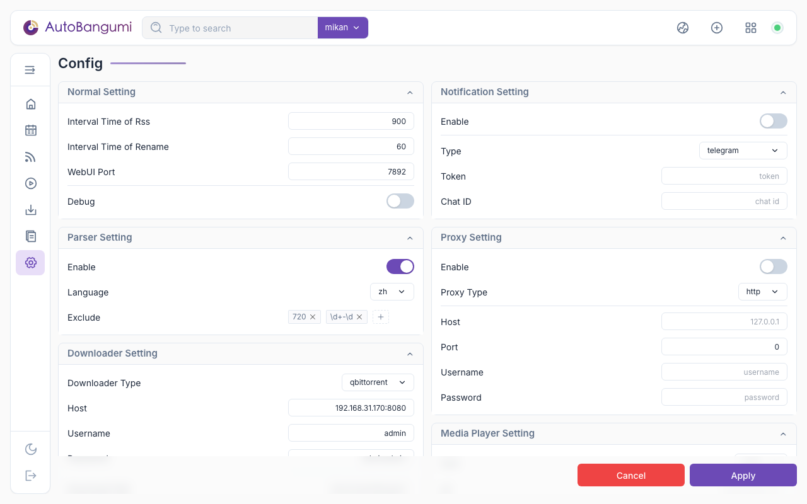
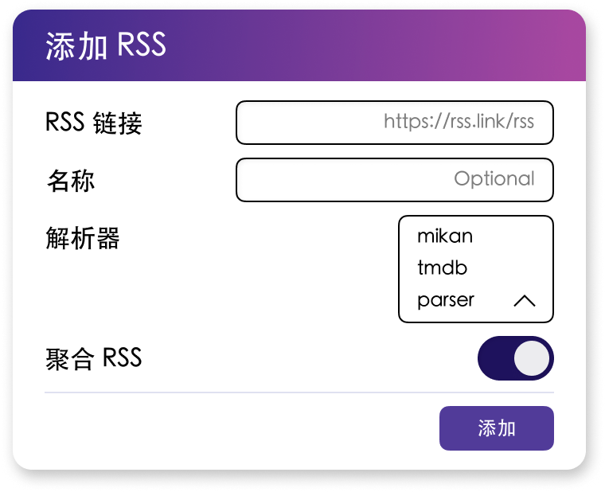

# 快速开始

我们推荐你在 Docker 中部署运行 AutoBangumi。
部署前请确认已经安装了 [Docker Engine][docker-engine] 或者 [Docker Desktop][docker-desktop]。

## 创建数据和配置文件夹

为了保证 AB 在每次更新之后数据和配置不丢失，推荐使用 bind mount  或者 Docker volume 进行数据和配置的持久化。


```shell
# 使用 bind mount
mkdir -p ${HOME}/AutoBangumi/{config,data}
cd ${HOME}/AutoBangumi
```

bind mount 与 Docker volume 二选一

```shell
# 使用 Docker volume
docker volume create AutoBangumi_config
docker volume create AutoBangumi_data
```

## 使用 Docker 部署 AutoBangumi

使用以下命令时请确保处于AutoBangumi目录下。

### 选项1: 使用 Docker-cli 部署

复制以下命令运行即可。

```shell
docker run -d \
  --name=AutoBangumi \
  -v ${HOME}/AutoBangumi/config:/app/config \
  -v ${HOME}/AutoBangumi/data:/app/data \
  -p 7892:7892 \
  -e TZ=Asia/Shanghai \
  -e PUID=$(id -u) \
  -e PGID=$(id -g) \
  -e UMASK=022 \
  --network=bridge \
  --dns=8.8.8.8 \
  --restart unless-stopped \
  ghcr.io/estrellaxd/auto_bangumi:latest
```

### 选项2: 使用 Docker-compose 部署

复制以下内容到 `docker-compose.yml` 文件中。

```yaml
version: "3.8"

services:
  AutoBangumi:
    image: "ghcr.io/estrellaxd/auto_bangumi:latest"
    container_name: AutoBangumi
    volumes:
      - ./config:/app/config
      - ./data:/app/data
    ports:
      - "7892:7892"
    network_mode: bridge
    restart: unless-stopped
    dns:
      - 223.5.5.5
    environment:
      - TZ=Asia/Shanghai
      - PGID=$(id -g)
      - PUID=$(id -u)
      - UMASK=022
```

运行以下命令启动容器。

```shell
docker compose up -d
```

## 安装 qBittorrent

如果你没有安装 qBittorrent，请先安装 qBittorrent。

- [在 Docker 中安装 qBittorrent][qbittorrent-docker]
- [在 Windows/macOS 中安装 qBittorrent][qbittorrent-desktop]
- [在 Linux 中安装 qBittorrent-nox][qbittorrent-nox]

## 获取聚合 RSS 链接 (以蜜柑计划的聚合 RSS 为例)

进入 [MiKan Project][mikan-project]，注册账号并登录，然后点击右下角的 **RSS** 按钮，复制链接。

{data-zoomable}

获取的 RSS 地址如下：

```txt
https://mikanani.me/RSS/MyBangumi?token=xxxxxxxxxxxxxxxxxxxxxxxxxxxxxxxx
# 或者
https://mikanime.tv/RSS/MyBangumi?token=xxxxxxxxxxxxxxxxxxxxxxxxxxxxxxxx
```

详细步骤参考 [Mikan RSS][config-rss]


## 配置 AutoBangumi

安装好 AB 之后，AB 的 WebUI 会自动运行，但是主程序会处于暂停状态，可以进入 `http://abhost:7892` 进行配置。

1. 填入下载器的地址，端口，用户名和密码。

{width=500}{class=ab-shadow-card}

2. 点击 **Apply** 保存配置，此时 AB 会重启运行，当右上角的圆点变为绿色时，表示 AB 已经正常运行。

3. 点击右上角的添加按钮，勾选 **聚合 RSS**， 选择解析器类型，填入 Mikan RSS 的地址。

{width=500}{class=ab-shadow-card}

等待 AB 解析聚合 RSS，解析完成会自动添加番剧并且下载管理。


[docker-engine]: https://docs.docker.com/engine/install/
[docker-desktop]: https://www.docker.com/products/docker-desktop
[config-rss]: ../config/rss
[mikan-project]: https://mikanani.me/
[qbittorrent-docker]: https://hub.docker.com/r/superng6/qbittorrent
[qbittorrent-desktop]: https://www.qbittorrent.org/download
[qbittorrent-nox]: https://www.qbittorrent.org/download-nox
