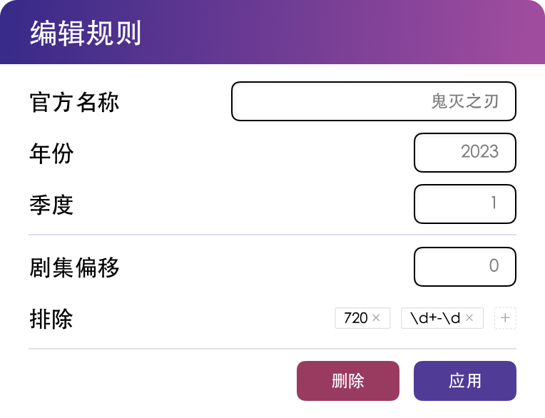

# Bangumi Management

Click an anime poster on the homepage to manage individual anime entries.

## Disable / Delete Anime

Since AB continuously parses **aggregated RSS** feeds, for download rules from aggregated RSS that you no longer need:
- Disable anime: The anime won't be downloaded or re-parsed
- Remove the subscription from the aggregated RSS

If you delete the anime entry, it will be recreated on the next parse cycle.
