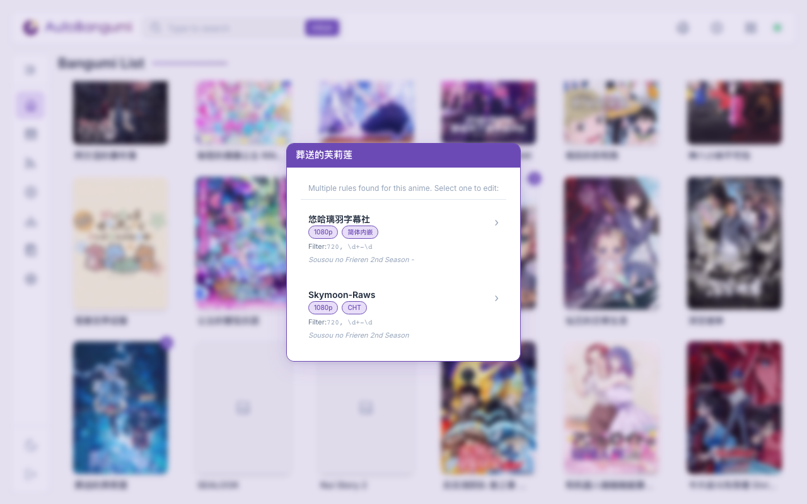
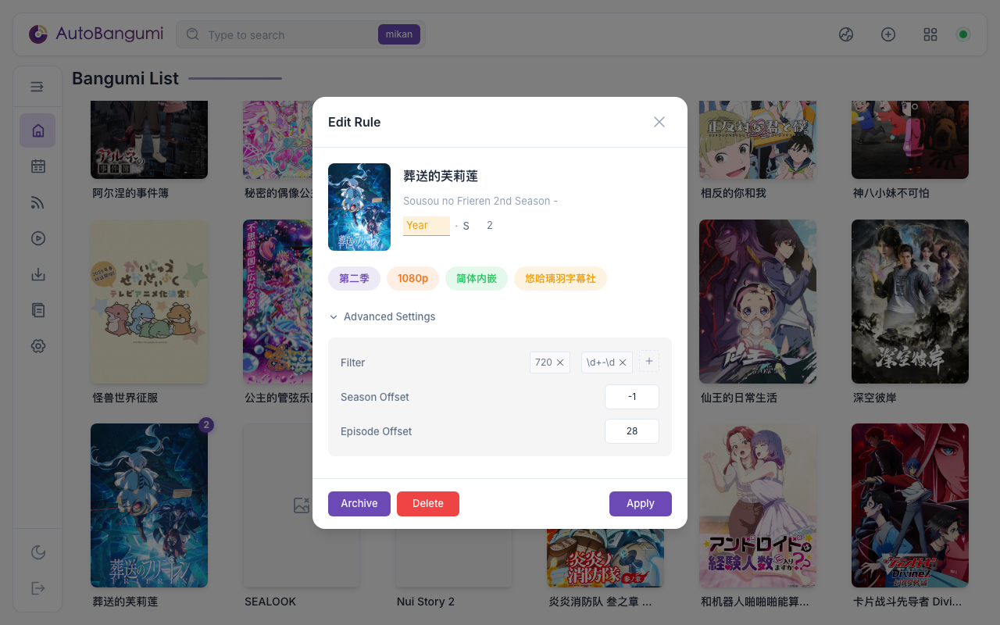

# Bangumi Management

Click an anime poster on the homepage to manage individual anime entries.

If an anime has multiple download rules (e.g., different subtitle groups), a rule selection popup will appear:

After selecting a rule, the edit modal opens:

## Notification Badges

Since v3.2, bangumi cards display iOS-style notification badges to indicate status:

- **Yellow badge with `!`**: Subscription needs review (e.g., offset issues detected)
- **Number badge**: Multiple rules exist for this anime
- **Combined badge** (e.g., `! | 2`): Has warning and multiple rules

Cards with warnings also display a yellow glow animation to draw attention.

## Episode Offset Auto-Detection

Some anime have complex season structures that cause mismatches between RSS episode numbers and TMDB data. For example:
- "Frieren: Beyond Journey's End" Season 1 was broadcast in two parts with a 6-month gap
- RSS may show "S2E01" while TMDB considers it "S1E29"

AB v3.2 can automatically detect these issues:

1. Click the **Auto Detect** button in the edit modal
2. AB analyzes TMDB episode air dates to identify "virtual seasons"
3. If a mismatch is found, AB suggests the correct offset values
4. Click **Apply** to save the offset

The background scan thread also periodically checks existing subscriptions for offset issues and marks them for review.

## Archive / Unarchive Anime

Since v3.2, you can archive completed or inactive anime to keep your list organized.

### Manual Archive

1. Click on an anime poster
2. In the edit modal, click the **Archive** button
3. The anime moves to the "Archived" section at the bottom of the list

### Automatic Archive

AB can automatically archive anime when:
- The series status on TMDB shows as "Ended" or "Canceled"
- Use **Config** → refresh metadata to trigger auto-archive

### Viewing Archived Anime

Archived anime appear in a collapsible "Archived" section at the bottom of the bangumi list. Click to expand and view archived items.

### Unarchive

To restore an archived anime:
1. Expand the "Archived" section
2. Click on the anime poster
3. Click the **Unarchive** button

## Disable / Delete Anime

Since AB continuously parses **aggregated RSS** feeds, for download rules from aggregated RSS that you no longer need:
- Disable anime: The anime won't be downloaded or re-parsed
- Remove the subscription from the aggregated RSS

If you delete the anime entry, it will be recreated on the next parse cycle.

## Advanced Settings

Click **Advanced Settings** in the edit modal to access additional options:

- **Season Offset**: Adjust the season number offset
- **Episode Offset**: Adjust the episode number offset
- **Filter**: Custom regex filter for torrent matching
