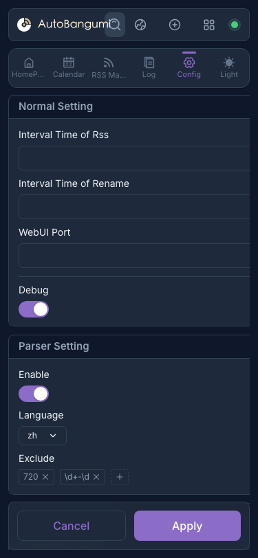

# 种子搜索

从 v3.1 开始，AB 包含搜索功能，可快速查找番剧。

## 使用搜索功能

::: warning
搜索功能依赖主程序的解析器。当前版本不支持解析收藏。解析收藏时出现 `warning` 是正常现象。
:::

搜索栏位于 AB 顶栏。点击打开搜索面板。


选择资源站，输入关键词，AB 将自动解析并显示搜索结果。要添加番剧，点击卡片右侧的添加按钮。

::: tip
当资源站为 **Mikan** 时，AB 默认使用 `mikan` 解析器。其他资源站使用 TMDB 解析器。
:::

## 管理搜索源

从 v3.2 开始，您可以直接在设置页面管理搜索源，无需编辑 JSON 文件。

### 搜索源设置面板

导航至 **配置** → **搜索源** 访问设置面板。



在这里您可以：
- **查看** 所有已配置的搜索源
- **添加** 新搜索源，使用"添加源"按钮
- **编辑** 现有源的 URL
- **删除** 自定义源（默认源 mikan、nyaa、dmhy 不能删除）

### URL 模板格式

添加自定义源时，URL 必须包含 `%s` 作为搜索关键词的占位符。

示例：
```
https://example.com/rss/search?q=%s
```

`%s` 将被替换为用户的搜索查询。

### 默认源

以下源为内置源，不能删除：

| 源 | URL 模板 |
|----|----------|
| mikan | `https://mikanani.me/RSS/Search?searchstr=%s` |
| nyaa | `https://nyaa.si/?page=rss&q=%s&c=0_0&f=0` |
| dmhy | `http://dmhy.org/topics/rss/rss.xml?keyword=%s` |

### 通过配置文件添加源

您也可以通过编辑 `config/search_provider.json` 手动添加源：

```json
{
  "mikan": "https://mikanani.me/RSS/Search?searchstr=%s",
  "nyaa": "https://nyaa.si/?page=rss&q=%s&c=0_0&f=0",
  "dmhy": "http://dmhy.org/topics/rss/rss.xml?keyword=%s",
  "bangumi.moe": "https://bangumi.moe/rss/search/%s"
}
```
