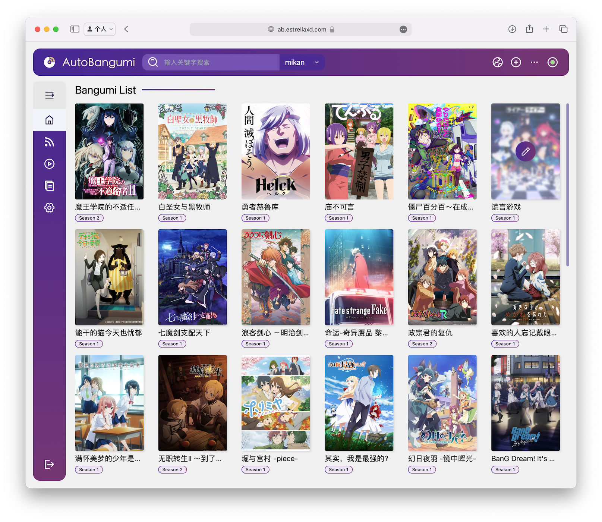

<p align="center">
<picture>
  <source media="(prefers-color-scheme: dark)" srcset="../image/icons/dark-icon.svg">
  <source media="(prefers-color-scheme: light)" srcset="../image/icons/light-icon.svg">
  
</picture>
</p>


## 关于 AutoBangumi


<p align="center">
  
</p>

**`AutoBangumi`** 是一款基于 RSS 订阅的全自动番剧下载和整理工具。只需在 [Mikan Project][mikan] 或类似网站订阅番剧，即可自动追踪和下载最新剧集。

整理后的文件名和目录结构可直接兼容 [Plex][plex]、[Jellyfin][jellyfin] 等媒体库软件，无需额外的元数据刮削。

## 功能特性

- 简单的一次性配置，持续使用
- 无需操心的 RSS 解析器，可提取番剧信息并自动生成下载规则
- 番剧文件整理：

  ```
  Bangumi
  ├── bangumi_A_title
  │   ├── Season 1
  │   │   ├── A S01E01.mp4
  │   │   ├── A S01E02.mp4
  │   │   ├── A S01E03.mp4
  │   │   └── A S01E04.mp4
  │   └── Season 2
  │       ├── A S02E01.mp4
  │       ├── A S02E02.mp4
  │       ├── A S02E03.mp4
  │       └── A S02E04.mp4
  ├── bangumi_B_title
  │   └─── Season 1
  ```

- 全自动重命名——超过 99% 的番剧文件在重命名后可被媒体库软件直接刮削

  ```
  [Lilith-Raws] Kakkou no Iinazuke - 07 [Baha][WEB-DL][1080p][AVC AAC][CHT][MP4].mp4
  >>
  Kakkou no Iinazuke S01E07.mp4
  ```

- 基于父文件夹名称自定义重命名所有子文件
- 季中追番补全当季所有缺失剧集
- 高度自定义选项，可针对不同媒体库软件进行微调
- 零维护，完全透明运行
- 内置 TMDB 解析器，可生成完整的 TMDB 格式文件和番剧元数据
- 支持 Mikan RSS 订阅的反向代理

## 社区

- 更新通知：[Telegram 频道](https://t.me/autobangumi_update)
- Bug 反馈：[Telegram](https://t.me/+yNisOnDGaX5jMTM9)

## 致谢

感谢 [Sean](https://github.com/findix) 对项目的大力帮助。

## 参与贡献

欢迎提交 Issues 和 Pull Requests！

<a href="https://github.com/EstrellaXD/Auto_Bangumi/graphs/contributors">
  
</a>

## 免责声明

由于 AutoBangumi 通过非官方版权渠道获取番剧：

- **请勿**将 AutoBangumi 用于商业用途。
- **请勿**制作包含 AutoBangumi 的视频内容并在国内视频平台（版权相关方）上发布。
- **请勿**将 AutoBangumi 用于任何违反法律法规的活动。

AutoBangumi 仅供学习和个人使用。

## 许可证

[MIT License](https://github.com/EstrellaXD/Auto_Bangumi/blob/main/LICENSE)

[mikan]: https://mikanani.me
[plex]: https://plex.tv
[jellyfin]: https://jellyfin.org
