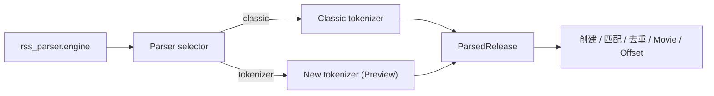

# Classic / Preview 解析器选择设计

## 背景

新的 candidate/resolver tokenizer 已完成通用资源解析、范围、OVA、剧场版和
混合合集支持，但仍需要在真实用户环境中逐步验证。版本内同时提供稳定的旧
tokenizer 与新 tokenizer，由用户显式选择，可以在不改变默认行为的前提下发布
Preview。

这里的 Classic 指本次 tokenizer 重构前的实现，即 commit `64e29c2d`，不是更
早期的正则 `raw_parser`。

## 已确认的产品决策

- 全新安装和已有配置都默认使用 Classic。
- Preview 必须由用户主动选择。
- 两套解析器严格切换；Preview 失败时不自动回退 Classic。
- 用户配置的 LLM primary/fallback 逻辑保持现有语义，但不能覆盖 Preview 对
  range、collection、PV 等资源的安全拒绝。
- Preview 可随版本发布，不引入独立运行包或数据库 migration。

## 配置与界面

在 `rss_parser` 中新增稳定配置值：

```toml
[rss_parser]
engine = "classic" # classic | tokenizer
```

配置值使用 `classic` / `tokenizer`，避免 Preview 转正式时再次迁移配置。缺少
字段的旧配置由 Pydantic 模型补成 `classic`；非法值由配置 API 返回校验错误。

解析设置页在“启用解析器”下增加“标题解析器”选择框：

- `经典解析器（稳定）` → `classic`
- `通用解析器（Preview）` → `tokenizer`

帮助文案说明 Classic 保持现有行为，Preview 支持剧集、OVA、剧场版、范围与
混合合集，并明确两种模式不会自动互相回退。界面继续使用现有 `ab-setting` 和
select 组件，不新增弹窗或独立页面。

## 后端架构

保留两个独立实现：

- `tokenizer/classic.py`：冻结 commit `64e29c2d` 的旧 tokenizer。
- 当前 `tokenizer/parser.py`：candidate/resolver Preview 实现。

新增集中选择器，例如 `module/parser/analyser/selector.py`。选择器在一次解析开始
时只读取一次 `settings.rss_parser.engine`，返回所选实现的 `ParsedRelease`；Preview
还可返回原生 trace，Classic 不伪造 trace。



所有运行时消费者必须统一使用选择器：

- `TitleParser`
- RSS engine 与偏好去重
- Bangumi 和 Movie 匹配
- OffsetScanner
- `analyser/raw_parser.py` 兼容入口

底层 `tokenizer.parse_release_title()` 保持为 Preview 原语，供 golden tests、trace、
benchmark 和诊断工具直接调用，不受全局配置影响。

## 数据流与错误处理

配置保存后沿用现有配置重载流程。每次资源解析捕获一次 engine，保证配置重载不
会让同一个资源的不同阶段使用不同实现；新任务读取更新后的配置。

- Classic 返回 `None`：沿用 Classic 与当前 LLM 配置的处理方式。
- Preview 返回 `None`：记录 Preview 失败，不调用 Classic。
- Preview 返回不可入库类型：继续由 release policy 拒绝，LLM 不得绕过。
- 非法 engine：配置层拒绝，不在运行时静默纠正。
- 日志应包含实际 engine，便于用户反馈和问题定位。

## 测试计划

### Classic 冻结回归

从 `64e29c2d` 恢复实现及代表性测试，覆盖标题、季度、集数、Movie、OVA 和已知
边界。加入至少一组 Classic 与 Preview 结果不同的样例，证明两种选项不是同一
实现的不同标签。

### 配置与选择器

- 缺失 engine 默认 `classic`。
- GET/PATCH 可保存两种合法值，非法值返回 422。
- Selector 两种模式真实分流，单次解析只读取一次配置。
- Preview 失败时 Classic 不被调用。

### 业务集成

验证 `TitleParser`、RSS 匹配、偏好去重、Bangumi/Movie 匹配、OffsetScanner 和
兼容入口全部跟随同一个 engine。Preview 下三个已修复的 Mikan 场景必须得到新
结果；默认 Classic 必须保持重构前行为。

### 前端

更新配置类型、默认 mock、中英文文案和设置项，并运行类型检查、ESLint 与生产
构建。选择器使用现有带标签的表单组件，保持键盘访问和焦点行为。

## 发布与回滚

- 两套解析器随当前开发版本一起打包。
- 默认始终为 Classic，不自动迁移用户到 Preview。
- Changelog 说明 Preview 能力、限制以及切回 Classic 的方式。
- 不修改数据库 schema。
- 回滚只需在设置页选择 Classic，无需降级程序或修改数据库。

## 验收标准

1. 默认安装及旧配置的行为与 `64e29c2d` 一致。
2. 主动选择 Preview 后，新 tokenizer 的范围和混合资源修复生效。
3. 所有业务消费者对同一资源使用同一解析器。
4. Preview 失败不回退 Classic，安全拒绝不会被 LLM 绕过。
5. 后端全量测试、静态检查和前端类型检查、Lint、生产构建全部通过。
